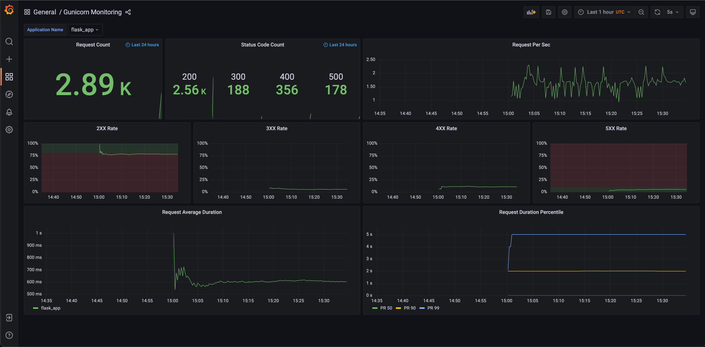

# Gunicorn Monitoring

Monitor [Gunicorn](https://github.com/benoitc/gunicorn) application (e.g. Flask) through build-in [instrumentation](https://docs.gunicorn.org/en/stable/instrumentation.html) feature using the statsD protocol over UDP with Prometheus and Grafana.

1. Gunicorn instrumentation sends StatsD format metrics by UDP to statsd_exporter
2. Prometheus scrapes prometheus format metrics from statsd_exporter 
3. Grafana queries data from Prometheus

```txt
+--------------------+                     +-------------------+                        +--------------+               +-----------+
|  Gunicorn(StatsD)  |---(UDP repeater)--->|  statsd_exporter  |<---(scrape /metrics)---|  Prometheus  | <---(query)---|  Grafana  |
+--------------------+                     +-------------------+                        +--------------+               +-----------+
```

This demo project is inspired by [Monitoring Gunicorn with Prometheus](https://medium.com/@damianmyerscough/monitoring-gunicorn-with-prometheus-789954150069).

## Quick Start

1. Build application image and start all service with docker-compose

   ```bash
   docker-compose build
   docker-compose up -d
   ```

2. Send requests with [siege](https://linux.die.net/man/1/siege) to Gunicorn app

   ```bash
   bash request-script.sh
   ```

3. Check predefined dashboard ```Gunicorn Monitoring``` on Grafana [http://localhost:3000/](http://localhost:3000/)

   Dashboard screenshot:

   

   Dashboard is also available on [Grafana Dashboards](https://grafana.com/grafana/dashboards/16163).

## Details

### Gunicorn

According to [Gunicorn Doc](https://docs.gunicorn.org/en/stable/instrumentation.html), we can send StatsD format metrics by setting ```statsd-host``` and ``` statsd-prefix``` options:

```bash
$ gunicorn --statsd-host=localhost:8125 --statsd-prefix=service.app ...
```

We utilize environment variable to setting ```statsd-host``` and ``` statsd-prefix``` in application image command and compose file:

```Dockerfile
# flask_app/Dockerfile
CMD gunicorn --bind=0.0.0.0:8000 --statsd-host=${STATSD_HOST}:${STATSD_PORT} --statsd-prefix=${APP_NAME} app:app
```

```yaml
services:
  app:
    build: ./flask_app/
    environment:
      APP_NAME: "flask_app"
      STATSD_HOST: "statsd-exporter"
      STATSD_PORT: "9125"
```

### Statsd Exporter

[statsd exporter](https://github.com/prometheus/statsd_exporter) receives StatsD-style metrics and exports them as Prometheus metrics.

Ports:

1. 9125: default StatsD request listen port, send StatsD request to this port
2. 9102: Web expose port, get prometheus metrics from this port

Prometheus metrics is available on [http://localhost:9102/metrics](http://localhost:9102/metrics).

For a better usability in Prometheus, we use statsd exporter [mapping](https://github.com/prometheus/statsd_exporter#metric-mapping-and-configuration) feature to processing these metrics. Because Gunicorn StatsD-style metrics are defined in [Gunicorn codebase](https://github.com/benoitc/gunicorn/blob/master/gunicorn/instrument/statsd.py), and unable to change.

The mapping is defined in ```etc/statsd-exporter/statsd.conf``` and using with ```statsd.mapping-config``` options in compose file.

```yaml
services:
  statsd-exporter:
    image: prom/statsd-exporter:v0.22.4
    volumes:
      - ./etc/statsd-exporter/statsd.conf:/statsd/statsd.conf # mapping file
    command:
      - --statsd.mapping-config=/statsd/statsd.conf # options
```

We add some labels in metrics for Prometheus with mapping config ```etc/statsd-exporter/statsd.conf```:

1. app: extract from ```statsd-prefix```
2. status: extract from status code in metrics name

```conf
# etc/statsd-exporter/statsd.conf
mappings:
  - match: "*.gunicorn.request.status.*"
    help: "gunicorn response code"
    name: "gunicorn_response_code"
    labels:
      app: "$1"
      status: "$2"
  - match: "*.gunicorn.workers"
    name: "gunicorn_workers"
    labels:
      app: "$1"
  - match: "*.gunicorn.requests"
    name: "gunicorn_requests"
    labels:
      app: "$1"
  - match: "*.gunicorn.request.duration"
    name: "gunicorn_request_duration"
    labels:
      app: "$1"
```

### Prometheus

Setting scrape job of statsd-exporter with config file ```etc/prometheus/prometheus.yml```.

```yaml
scrape_configs:
  - job_name: 'statsd-exporter'
    static_configs:
      - targets: ['statsd-exporter:9102']
```

Prometheus build-in web UI is available on [http://localhost:9090](http://localhost:9090).

### Grafana

Add prometheus to data source with config file ```etc/grafana/datasource.yml```.

```yml
datasources:
  # <string, required> name of the datasource. Required
  - name: Prometheus
    # <string, required> datasource type. Required
    type: prometheus
    # <string, required> access mode. proxy or direct (Server or Browser in the UI). Required
    access: proxy
    # <int> org id. will default to orgId 1 if not specified
    orgId: 1
    # <string> custom UID which can be used to reference this datasource in other parts of the configuration, if not specified will be generated automatically
    # uid: my_unique_uid
    # <string> url
    url: http://prometheus:9090
    # <bool> mark as default datasource. Max one per org
    isDefault: true
    version: 1
    # <bool> allow users to edit datasources from the UI.
    editable: false
```

Load predefined dashboard with ```etc/dashboards.yaml``` and ```etc/dashboards/gunicorn-monitoring.json```.

```yaml
# grafana in docker-compose.yaml
grafana:
    image: grafana/grafana:8.4.3
    volumes:
      - ./etc/grafana/:/etc/grafana/provisioning/datasources
      - ./etc/dashboards.yaml:/etc/grafana/provisioning/dashboards/dashboards.yaml # dashboard setting
      - ./etc/dashboards:/etc/grafana/dashboards # dashboard json files directory
```

# Reference

1. [Monitoring Gunicorn with Prometheus](https://medium.com/@damianmyerscough/monitoring-gunicorn-with-prometheus-789954150069)
